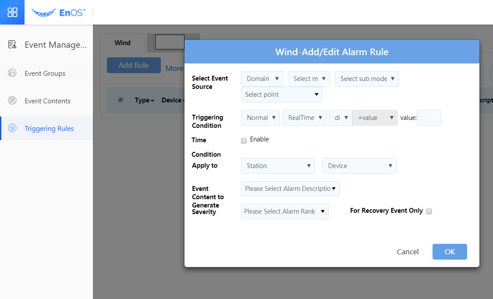
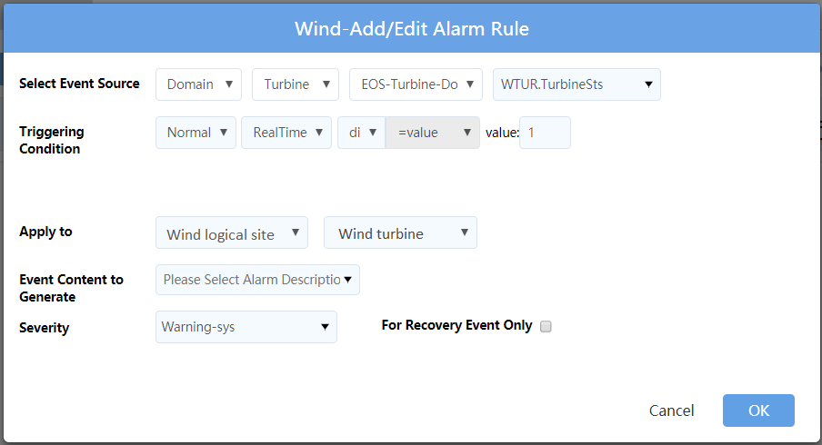

# Creating event rules

This topic instructs how to create the triggering rule of an event.

You can define triggering rules for a data measuring point of a domain or the communication model of a device point.

In wind turbine example, you can define a triggering rule when the wind speed is over 30m/s, the severity level, and the content to report when the event occurs.

## Before you start

Ensure that the event content to be used by the triggering rule is created. For more information, see [Creating event contents](create_event_content).

## Procedure

1. Click **Event Management > Triggering rules** from the left navigation panel of the EnoS Console.

2. Click the **Add rule** button in the domain to where the event group belongs.

   

   - **Select Event Source**

     The event source is the domain point of the wind turbine state that is defined in the **Device Models**, the state point of the wind turbine is mapping to this domain point. For more information, see [Device modelling]<https://docs.eniot.com/docs/device-connection/en/latest/device_modelling/model_overview.html>.

   - **Triggering Condition**

     - If you choose _di_, specify a value that triggers the event.
     - If you choose _ai_, specify a value range that triggers the event.

    In the wind turbine scenario, you'll need to create a triggering rule for each DI value.

   - **Apply to**

    The triggering rule can apply to a station or device.
    You can specify all or a single site / device.

   - **Event content to generate**

    Select the event content that has been defined.

    An event content can be assigned to multiple triggering rules.

   - **Severity**

    Select a severity level, which is already defined according to your business needs.

   - **For Recovery Event only**

    Check this checkbox if the triggering rule is used for a recovery event. The Recovery event represents a normal condition, which can be used to end the raised events.

### Example of configuring a triggering rule for wind turbines

The following figure shows an example of configuring the triggering rule for a wind turbine.

In this example, if the DI value of the wind turbine retured from the measuring point is _1_, which means _shutdown_ and other conditions are all matched, an event will be triggered.

