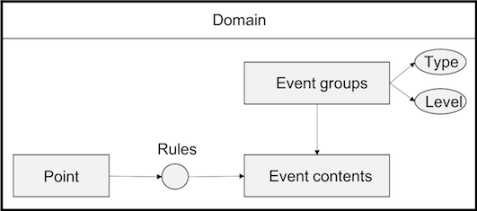

# Event management overview

The EnOS Event Management service enables you to receive, process, and generate events on your devices. The service also allows you to define event triggering rules against the device data, to achieve real-time alarming and troubleshooting.

## Key concepts

An _event_ is a record generated by the system when the value of a  measuring point in a certain domain reaches a specific condition.

The condition that iggers the event is the _event rule_, what's generated by the system is the _event content_. As measuring points or events may vary, to distinguish and manage the events more effectively, events are usually classified into _event groups_.

The events on EnOS are typically classified based on the _severity_ (such as danger, critical, error, warning, and information) and _type_ (such as over-limit).

The event management message flow and the key concepts are illustrated in the following figure:

## Major functions

**Forward event data to EnOS in a standard data structure**

The event management service defines standard event data structure and event receiving interfaces to allow event data to be tranmitted to EnOS cloud at the real-time or in batch processing mode. For the EnOS cloud to be able to process the event data, you must use the Event Management service to define the standard event data structure that is accepted by EnOS

**Support defing event tiggering rules and generated contents**

The Event Management service allows you to define event triggering rule for specific data measuring points of a domain. For example, you can define an over-limit rule which triggers an event when the value of the measuring point exceeds a threshold. 如风机，光伏逆变器，升压站设备等，对接入设备的测点定义事件产生的规则（如机舱温度大于45摄氏度，升压站断路器跳闸等），满足设备实时监控及后期故障分析的业务需求。

As the same time, you can defines event groups according to best practices. For example, you can define event types such as communication abnormality and performance degrading. And you can define the typical event severities: information, warining, and error according to your business requirements.

**Supports query, subscription, push event data from EnOS**

Event Management provide APIs for event data related actions such as querying, subscribing, and pushing events. You can develop your own alarm application or perform analytics based on these APIs. By subscribing to events and integrating with e-mail service or message service， you can also develop your own alarm applications such as alarm pop-ups, real-time and historical alarm inquiry, and e-mail and message alarm alerts.

**Support integrating 3rd-party event data**
EnOS系统也可以接受在第三方系统当中产生的事件信息。例如在船舶领域，站端Scada接收船讯网的告警信息以后，可以再将船讯网告警信息格式化为EnOS系统的标准事件格式以后，转发至EnOS系统。平台事件服务模块以接口形式提供事件的存储、查询、订阅等服务。

**注意**: 针对MQTT方式接入的设备，即使配置了告警规则，默认也不支持产生告警。如果需要生成告警，需要配置规则引擎。目前规则引擎未对外开发，针对规则引擎的配置，请联系项目经理或者系统管理员。
