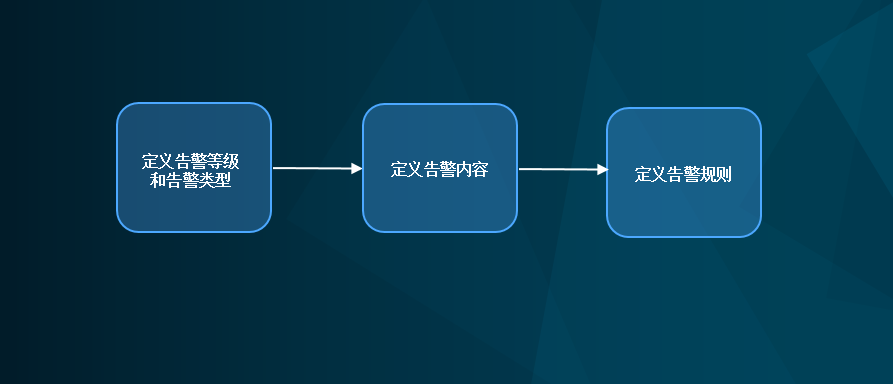

# Getting started with event management
<!--
The short description should be a single, concise paragraph that contains one or two sentences and no more than 50 words.
Briefly mention what the user's learning goal is and include the following SEO keywords in the title short description: EnOS, ServiceName, tutorial.
-->

A typical flow to configure event management for your devices connected to EnOS cloud is as follow:

### Step 1: Configuring event groups

1. Configuring event severity
2. Configuring event types

For more information, see [Creating event groups](create_event_group.md).

### Step 2: Configuring event contents

For more information, see

For more information, see [Creating event content](create_event_content.md).

### Step 3: Configuring event rules
